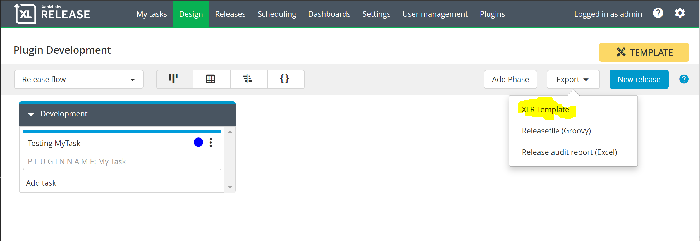

# XL Release Plugin Development

Plugin development depends on a set of tools, a development context and a testing context.

## Tools ##

- IDE of your choice. Ideally you will want syntax support for java, python, xml, and json
- [Git](https://git-scm.com/)
- [Gradle Build Tool](https://gradle.org/)
- [Docker](https://www.docker.com/products/docker-desktop)
- [Docker Compose](https://docs.docker.com/compose/install/)

## Development Environment

The approach I use is to open the project root in an IDE (Visual Code in my case).  I then have two terminal sessions as follows...

**Terminal 1**

```bash
cd <project root>
```

**Terminal 2**

```bash
cd <project root>/src/test/resources
```

Terminal 1 is where I issue gradlew commands.  Terminal 2 is where I run docker and docker-compose commands.

## Testing Environment

Once you get beyond unit testing, you'll want a testing environment where you can (reasonably) quickly deploy your plugin into a live XL Release instance.

These project templates use Docker Compose to run containers for development and integration testing.  Typically there are three containers as follows...

| Container | Purpose |
| --------- | ------- |
| plugin_xlr | Runs desired version of XL Release |
| plugin_XXX | Runs a service host that your plugin will call.  This may be an actual instances of that service or a mock server. Our project templates use a mock server based on Flask. |
| plugin_xlr_init | Runs a script, after plugin_xlr is started, that loads configurations and templates needed to support testing. |

### Using a Development Template

To test your plugin, you'll need to create a template in XL Release that uses your plugin' tasks.  You'll create releases from this template to test your plugin's functionality.  Often you will also need to create shared configurations (i.e. host server configuration) to support your plugin.  

#### Manually Create The Shared Configuration

You can't export Shared Configuration items from XL Release.  However the structure is very simple so you can create them from scratch.  Here is an example configuration for a SauceLabs server...

```bash
{
  "type":"saucelabs.Server",
  "title":"saucelabs",
  "url":"http://saucelabs-stub:5000",
  "username": "xlr_test",
  "password": "admin"
}
```

The 'title' property must match exactly the 

#### Load Configuration On 

Use the same approach to load more templates or configurations.

#### Manually Create The Template

With XL Release running, manually create or modify the existing Plugin Development Template.  Export the template in XLR Template format...



The file will download in your browser.  The XLR Template format (extension .xlr) is a zip archive.  Open the archive and copy the contents of 'release-template.json' to...

```bash
<project root>/src/test/resources/initialize/data/<your template name>.json
```

#### Load Template On Startup

The 'plugin_xlr_init' Docker container is used to initialize the XL Release instance running in the 'plugin_xlr' container.  To have your template loaded on startup, add a curl command to the '\<project root\>/src/test/resources/initialize/run.sh' script as shown below...

```bash
#!/bin/sh

# use curl to load initial templates and/or configuration
echo "POST template to " $XLR_HOST
curl  -u admin:admin 'http://xlr:5516/api/v1/phases/Applications/Release1a/phase' -i -X POST -H 'Content-Type: application/json' -H 'Accept: application/json' -d @/tmp/data/PLUGINNAME_template.json

echo "init complete..."
```


## Development Process Flow

IDE @ project root

Terminal session @ project root

Terminal session @ src/test/resources

```bash
docker container rm plugin_xlr
docker-compose -f docker/docker-compose.yml build
docker-compose -f docker/docker-compose.yml up
```

Browser @ https://localhost:15516

### Getting A Shell Inside A Docker Container

Occassionally I'll have a third terminal where I can get a bash session in the plugin_xlr container.  This is sometimes necessary to view configurations, verify plugins, etc.  A bash session can be started with...

```bash
docker exec -i -t plugin_xlr /bin/bash
```

Type 'exit' to leave the session and return to your terminal.

